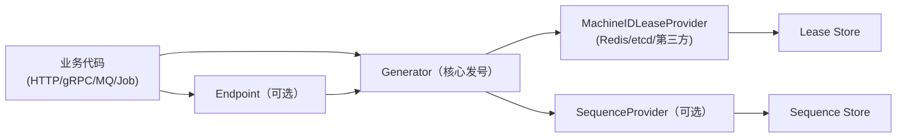

# shortid

`shortid` 是一个面向生产的 Go ID 生成 SDK。  
它兼容雪花算法思路，但把“机器ID分配”升级为**租约模型**，更适合云原生弹性场景。

## 1. 为什么从传统雪花迁移

传统雪花的核心风险是 `machine_id` 管理：固定配置或人工分配在容器/Serverless下容易冲突。

`shortid` 的迁移目标：

- 保留雪花的核心优点：`uint64`、高吞吐、按时间趋势递增。
- 将机器号管理升级为租约（可接 Redis / etcd / 第三方）。
- 业务接入保持简单：本地单机和分布式都走统一 API。

## 2. 雪花迁移对照（直观版）

| 雪花概念 | shortid 对应 | 迁移方式 |
|---|---|---|
| 固定 `machine_id` | `New(machineID, businessType)` | 单机/固定节点可直接迁 |
| 机器号中心分配 | `MachineIDLeaseProvider` | 推荐，替代人工机器号 |
| 序列号 | 本地序列或 `SequenceProvider` | 默认本地，强一致再上远端 |
| 生成 `int64` | `NextID(ctx) -> uint64` | 大多数场景直接替换 |

最短迁移示例：

```go
g, err := shortid.New(1, shortid.BusinessOrder)
if err != nil {
    panic(err)
}
id, err := g.NextID(context.Background())
```

## 3. 架构理念（可扩展，不绑框架）



设计原则：

- 核心发号与传输层解耦（HTTP/gRPC/MQ 共享一套发号逻辑）。
- 机器ID通过租约保证“持有者身份”和“自动过期”。
- 适配层可插拔：Redis/etcd/第三方都可实现接口接入。

## 4. 机器ID租约安全模型（分布式锁同级）

`MachineIDLeaseProvider` 要求：

- `Acquire`：原子抢占机器ID租约。
- `Renew`：必须 token CAS（只有持有者能续租）。
- `Release`：必须 token CAS（只有持有者能释放）。
- 失租后必须停止发号（返回错误）。

详细设计见 [docs/MACHINE_ID_LEASE.md](docs/MACHINE_ID_LEASE.md)。

## 5. 性能扩展怎么做

### 5.1 当前默认扩展路径

1. 单实例：固定 `MachineID`，本地序列（最低延迟）。
2. 弹性实例：`MachineIDLeaseProvider` + 本地序列（推荐）。
3. 跨实例强一致序列：再接 `SequenceProvider`（吞吐换一致性）。

### 5.2 Redis 租约实现优化点

- `Acquire` 使用 **单次 Lua** 在 Redis 侧完成“游标推进 + 槽位抢占”。
- `Renew/Release` 使用 token CAS，保证安全。
- `Slots` 可配置（默认64），便于按业务规模调优。

## 6. 本地实测（Redis租约模式）

测试命令：

```bash
go test -run 'TestPerf_RedisLeaseMode_(SingleInstance|TwoInstances|MultiInstances)$' -v ./...
```

测试环境（真实本机实测）：

- 时间：2026-03-08（最新实测）
- 机器：MacBook Pro (MacBookPro18,3)
- CPU：Apple M1 Pro，8 Core (6P + 2E)
- 内存：16 GB
- 系统：macOS 15.6 (Darwin 24.6.0, arm64)
- Redis：本地 Docker 单实例（`localhost:6379`）
- 模式：`MachineIDLeaseProvider`（Lua Acquire）+ 本地序列号

| 场景 | 请求量 | 总耗时 | 平均耗时 | QPS |
|---|---:|---:|---:|---:|
| 单实例（1个Generator） | 50,000 | 4.281s | 85.629µs | 11,678 |
| 双实例（2个Generator并发） | 60,000 | 2.597s | 43.280µs | 23,105 |
| 16实例并发 | 80,000 | 0.431s | 5.383µs | 185,748 |
| 32实例并发 | 96,000 | 0.268s | 2.788µs | 358,606 |
| 64实例并发 | 96,000 | 0.126s | 1.315µs | 759,904 |

说明：
- 上述数据来自当前机器实测日志（`go test -v` 输出），非理论估算。
- 16/32/64 场景主要反映“并行扩展能力”，不等同于线上端到端吞吐。
- 线上请按目标实例规格、网络与Redis拓扑复测。

## 7. 并发上限与短链系统容量估算

### 7.1 算法上限（单业务类型、单集群）

`shortid` 的时间粒度为 10ms，序列位宽 7 bit：

- 单 machineID 上限：`128 / 10ms = 12,800 QPS`
- 64 machineID 槽位总上限：`12,800 * 64 = 819,200 QPS`

本机最新实测峰值（64实例）为 **759,904 QPS**，约等于理论上限的 **92.8%**。

### 7.2 短链系统规模换算（按“发号能力”）

按 `QPS * 86,400` 估算每日可生成短链数：

| 场景 | QPS | 预估每日可生成短链 |
|---|---:|---:|
| 单实例 | 11,678 | 1,008,979,200（约 10.09 亿） |
| 双实例 | 23,105 | 1,996,272,000（约 19.96 亿） |
| 64实例（本机实测） | 759,904 | 65,655,705,600（约 656.56 亿） |
| 64实例（理论上限） | 819,200 | 70,778,880,000（约 707.79 亿） |

注意：
- 这是“ID生成层”的容量，不包含数据库写入、缓存命中、重定向服务与网络开销。
- 真正短链系统总吞吐通常由存储层与读写链路先到瓶颈。
- 超过单集群 64 槽位时，建议按业务分片/租户分片做多集群扩展。

## 8. 快速开始

安装：

```bash
go get github.com/gostool/shortid
```

基础验证：

```bash
go test ./...
SHORTID_REQUIRE_REDIS_TESTS=1 go test ./...
go test -race ./...
```

## 9. 相关文档

- [docs/INTEGRATION_QUICKSTART.md](docs/INTEGRATION_QUICKSTART.md)
- [docs/API_CONTRACT.md](docs/API_CONTRACT.md)
- [docs/UPGRADING.md](docs/UPGRADING.md)
- [docs/RELEASE_POLICY.md](docs/RELEASE_POLICY.md)
- [docs/MACHINE_ID_LEASE.md](docs/MACHINE_ID_LEASE.md)
